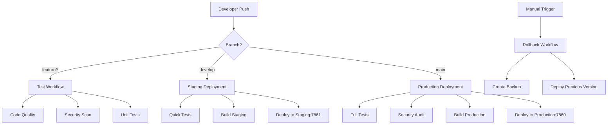

# Dattavani ASR Rust - CI/CD Guide

Complete guide for Continuous Integration and Continuous Deployment using GitHub Actions.

## 📋 Table of Contents

1. [Overview](#overview)
2. [Workflow Architecture](#workflow-architecture)
3. [Setup Instructions](#setup-instructions)
4. [Deployment Workflows](#deployment-workflows)
5. [Branch Strategy](#branch-strategy)
6. [Environment Management](#environment-management)
7. [Monitoring & Rollback](#monitoring--rollback)
8. [Best Practices](#best-practices)
9. [Troubleshooting](#troubleshooting)

## 🏗️ Overview

The CI/CD pipeline provides:

- **Automated Testing**: Code quality, security, and functionality tests
- **Multi-Environment Deployment**: Staging and production environments
- **Rollback Capability**: Quick rollback to previous versions
- **Security Scanning**: Dependency and code security checks
- **Performance Monitoring**: Deployment health checks and metrics

## 🔄 Workflow Architecture



## 🚀 Setup Instructions

### 1. Repository Secrets

First, set up the required GitHub secrets. See [.github/SETUP_SECRETS.md](.github/SETUP_SECRETS.md) for detailed instructions.

**Required Secrets:**
- `AWS_ACCESS_KEY_ID`
- `AWS_SECRET_ACCESS_KEY`
- `EC2_SSH_PRIVATE_KEY`

### 2. Quick Setup Script

```bash
# Clone the repository
git clone <your-repo-url> dattavani-asr-rust
cd dattavani-asr-rust

# Set up GitHub CLI and secrets
gh auth login
.github/setup-secrets.sh

# Test the setup
git checkout -b test-deployment
git push origin test-deployment
```

### 3. Verify Setup

Check that workflows are working:

1. Go to **Actions** tab in GitHub
2. Look for workflow runs
3. Verify all secrets are configured correctly

## 📊 Deployment Workflows

### 1. Test Workflow (`test.yml`)

**Triggers:**
- Pull requests to `main` or `develop`
- Pushes to `develop` or `feature/*` branches
- Manual dispatch

**What it does:**
- Code quality checks (formatting, linting)
- Cross-platform testing (Ubuntu, macOS)
- Security audits
- Documentation validation
- Docker build testing
- Configuration validation

**Example:**
```bash
# Trigger test workflow
git checkout -b feature/new-feature
git push origin feature/new-feature
```

### 2. Staging Deployment (`staging.yml`)

**Triggers:**
- Pushes to `develop` branch
- Manual dispatch

**What it does:**
- Quick tests for faster feedback
- Builds staging version
- Deploys to port 7861 on the same EC2 instance
- Runs smoke tests
- Uses smaller Whisper model for faster testing

**Configuration differences from production:**
- Port: 7861 (vs 7860 for production)
- Whisper model: `base` (vs `large-v3`)
- Max workers: 1 (vs 2)
- Debug logging enabled
- Reduced cache size

**Example:**
```bash
# Deploy to staging
git checkout develop
git merge feature/new-feature
git push origin develop
```

### 3. Production Deployment (`deploy.yml`)

**Triggers:**
- Pushes to `main` branch
- Merged pull requests to `main`
- Manual dispatch

**What it does:**
- Full test suite
- Security scanning
- Production build
- Deploys to port 7860
- Health checks
- Deployment verification

**Example:**
```bash
# Deploy to production
git checkout main
git merge develop
git push origin main
```

### 4. Rollback Workflow (`rollback.yml`)

**Triggers:**
- Manual dispatch only (for safety)

**What it does:**
- Creates AMI backup before rollback
- Builds previous version
- Deploys rollback version
- Verifies rollback success
- Creates incident report

**Example:**
```bash
# Trigger rollback via GitHub UI:
# 1. Go to Actions tab
# 2. Select "Rollback Deployment"
# 3. Click "Run workflow"
# 4. Choose environment and rollback target
```

## 🌿 Branch Strategy

### Branch Structure

```
main (production)
├── develop (staging)
│   ├── feature/user-authentication
│   ├── feature/performance-optimization
│   └── hotfix/critical-bug-fix
└── release/v1.2.0
```

### Branch Rules

1. **`main`** - Production branch
   - Protected branch
   - Requires PR reviews
   - Triggers production deployment
   - Only merge from `develop` or `hotfix/*`

2. **`develop`** - Staging branch
   - Integration branch
   - Triggers staging deployment
   - Merge feature branches here first

3. **`feature/*`** - Feature branches
   - Triggers test workflow
   - Create PR to `develop`
   - Delete after merge

4. **`hotfix/*`** - Critical fixes
   - Can merge directly to `main`
   - Also merge back to `develop`

### Workflow Examples

#### Feature Development
```bash
# 1. Create feature branch
git checkout develop
git pull origin develop
git checkout -b feature/new-asr-model

# 2. Develop and test
# ... make changes ...
git add .
git commit -m "Add new ASR model support"
git push origin feature/new-asr-model

# 3. Create PR to develop
# This triggers test workflow

# 4. After PR approval and merge
# Staging deployment is triggered automatically
```

#### Production Release
```bash
# 1. Merge develop to main
git checkout main
git pull origin main
git merge develop
git push origin main

# 2. Production deployment triggers automatically
# 3. Monitor deployment in Actions tab
```

#### Hotfix
```bash
# 1. Create hotfix from main
git checkout main
git pull origin main
git checkout -b hotfix/critical-security-fix

# 2. Fix the issue
# ... make changes ...
git add .
git commit -m "Fix critical security vulnerability"

# 3. Deploy to production
git checkout main
git merge hotfix/critical-security-fix
git push origin main

# 4. Merge back to develop
git checkout develop
git merge hotfix/critical-security-fix
git push origin develop

# 5. Clean up
git branch -d hotfix/critical-security-fix
git push origin --delete hotfix/critical-security-fix
```

## 🌍 Environment Management

### Production Environment
- **URL**: `http://<instance-ip>:7860`
- **Service**: `dattavani-asr`
- **Config**: Full performance configuration
- **Whisper Model**: `large-v3`
- **Workers**: 2
- **Logging**: Info level

### Staging Environment
- **URL**: `http://<instance-ip>:7861`
- **Service**: `dattavani-asr-staging`
- **Config**: Lightweight testing configuration
- **Whisper Model**: `base`
- **Workers**: 1
- **Logging**: Debug level

### Environment Variables

Both environments use these base variables:
```bash
RUST_LOG=info  # debug for staging
AWS_REGION=us-east-1
S3_BUCKET=dattavani
TEMP_DIR=/tmp/dattavani_asr  # /tmp/dattavani_asr_staging for staging
```

## 📊 Monitoring & Rollback

### Health Monitoring

Each deployment includes health checks:

```bash
# Production health check
curl http://<instance-ip>:7860/health

# Staging health check
curl http://<instance-ip>:7861/health
```

### Automated Rollback Triggers

Rollback is triggered manually, but you can monitor for:
- Health check failures
- High error rates
- Performance degradation
- User reports

### Rollback Process

1. **Immediate Response**
   ```bash
   # Go to GitHub Actions
   # Run "Rollback Deployment" workflow
   # Choose environment and target version
   ```

2. **Automatic Steps**
   - Creates AMI backup
   - Builds previous version
   - Deploys rollback
   - Verifies health
   - Creates incident report

3. **Post-Rollback**
   - Monitor rolled-back service
   - Investigate root cause
   - Fix issues in develop branch
   - Redeploy when ready

## 🎯 Best Practices

### 1. Code Quality

- Always run tests locally before pushing
- Use meaningful commit messages
- Keep PRs small and focused
- Add tests for new features

### 2. Deployment Safety

- Test in staging before production
- Monitor deployments closely
- Have rollback plan ready
- Use feature flags for risky changes

### 3. Security

- Regularly rotate AWS keys
- Keep dependencies updated
- Run security scans
- Monitor for vulnerabilities

### 4. Performance

- Monitor resource usage
- Optimize for GPU utilization
- Cache dependencies
- Use appropriate instance sizes

### 5. Documentation

- Update documentation with changes
- Document configuration changes
- Keep deployment guides current
- Record incident learnings

## 🔧 Troubleshooting

### Common Issues

#### 1. Deployment Fails

**Symptoms:**
- GitHub Actions workflow fails
- Service doesn't start
- Health checks fail

**Solutions:**
```bash
# Check workflow logs in GitHub Actions
# SSH into instance to debug
ssh ubuntu@<instance-ip>

# Check service status
sudo systemctl status dattavani-asr
sudo journalctl -u dattavani-asr -f

# Check application logs
tail -f ~/logs/dattavani-asr.log
```

#### 2. AWS Permissions Error

**Symptoms:**
```
Error: User is not authorized to perform: ec2:DescribeInstances
```

**Solutions:**
- Verify AWS credentials in GitHub secrets
- Check IAM user permissions
- Ensure correct AWS region

#### 3. SSH Connection Failed

**Symptoms:**
```
Error: Permission denied (publickey)
```

**Solutions:**
- Verify EC2_SSH_PRIVATE_KEY secret
- Check key format (include headers/footers)
- Ensure key matches EC2 instance key pair

#### 4. Service Port Conflicts

**Symptoms:**
- Service starts but not accessible
- Port already in use errors

**Solutions:**
```bash
# Check what's using the port
sudo netstat -tlnp | grep :7860

# Kill conflicting process if needed
sudo systemctl stop conflicting-service

# Restart the service
sudo systemctl restart dattavani-asr
```

#### 5. GPU Not Available

**Symptoms:**
- Slow transcription
- CPU-only processing

**Solutions:**
```bash
# Check GPU status
nvidia-smi

# Install NVIDIA drivers if needed
sudo apt update
sudo apt install -y nvidia-driver-470
sudo reboot
```

### Debug Commands

```bash
# Check instance status
aws ec2 describe-instances --instance-ids i-09726de87ad1f9596

# Check security group
aws ec2 describe-security-groups --group-ids sg-0264890af868ab040

# Test connectivity
curl -I http://<instance-ip>:7860/health

# SSH and check logs
ssh ubuntu@<instance-ip>
sudo systemctl status dattavani-asr
tail -f ~/logs/dattavani-asr.log
```

### Getting Help

1. **Check Documentation**
   - This guide
   - [DEPLOYMENT.md](DEPLOYMENT.md)
   - [QUICK_DEPLOY.md](QUICK_DEPLOY.md)

2. **Review Logs**
   - GitHub Actions workflow logs
   - Application logs on server
   - System logs

3. **Test Locally**
   - Run deployment scripts locally
   - Test AWS connectivity
   - Verify configurations

4. **Contact Team**
   - Create GitHub issue
   - Include relevant logs
   - Describe steps to reproduce

## 📈 Metrics and Monitoring

### Key Metrics to Monitor

1. **Deployment Success Rate**
   - Track successful vs failed deployments
   - Monitor deployment duration

2. **Service Health**
   - Response time
   - Error rates
   - Uptime percentage

3. **Resource Usage**
   - CPU utilization
   - GPU utilization
   - Memory usage
   - Disk space

4. **Business Metrics**
   - Transcription accuracy
   - Processing time
   - User satisfaction

### Monitoring Tools

- **GitHub Actions**: Deployment metrics
- **AWS CloudWatch**: Infrastructure metrics
- **Application logs**: Service-specific metrics
- **Custom dashboards**: Business metrics

## 🔄 Continuous Improvement

### Regular Tasks

1. **Weekly**
   - Review deployment metrics
   - Check for security updates
   - Monitor resource usage

2. **Monthly**
   - Update dependencies
   - Review and optimize workflows
   - Conduct deployment retrospectives

3. **Quarterly**
   - Security audit
   - Performance optimization
   - Infrastructure cost review

### Feedback Loop

1. **Collect Feedback**
   - Deployment issues
   - Performance problems
   - User experience

2. **Analyze and Improve**
   - Update workflows
   - Optimize configurations
   - Enhance monitoring

3. **Document Changes**
   - Update this guide
   - Share learnings
   - Train team members

---

**🎉 Your CI/CD pipeline is now ready! Push code changes to see automated testing and deployment in action.**

**Quick Start:**
1. Set up GitHub secrets
2. Push to `develop` for staging
3. Push to `main` for production
4. Monitor in GitHub Actions tab
