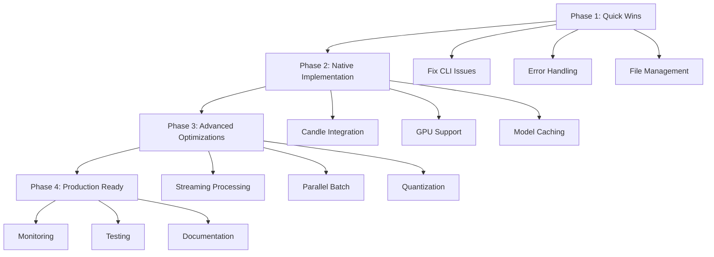

# 🚀 Master Issue: Dattavani ASR Performance Optimization Initiative

## 🎯 **Project Overview**
Transform Dattavani ASR from a Python CLI-dependent system to a high-performance, native Rust implementation with 10-50x performance improvements across all metrics.

## 📊 **Current vs Target Performance**

| Metric | Current | Target | Improvement |
|--------|---------|--------|-------------|
| **Model Loading** | 5-15s | 0.1-0.5s | **10-30x faster** |
| **Inference Time** | 2-5s | 0.5-1s | **4-10x faster** |
| **Memory Usage** | 2-4GB | 0.5-1GB | **4-8x reduction** |
| **Startup Time** | 10-20s | 1-2s | **10x faster** |
| **Batch Processing** | Sequential | Parallel | **N-core speedup** |
| **Dependencies** | Python + PyTorch | Native Rust | **Zero external deps** |

## 🗺️ **Implementation Roadmap**

### **Phase 1: Quick Wins** ⚡ (1-2 days)
**Status**: 🔄 Ready to Start  
**Priority**: 🔴 Critical  
**Issue**: [#XXX - Phase 1: Quick Wins](./phase-1-quick-wins.md)

**Objectives:**
- Fix current Python CLI integration issues
- Implement simple fallback mechanism  
- Add proper error handling and timeouts
- Optimize temporary file management

**Key Deliverables:**
- ✅ Zero CLI execution failures
- ✅ Consistent transcription results
- ✅ Proper error messages and logging
- ✅ Cleanup of temporary files
- ✅ Timeout handling for hanging processes

**Success Criteria:**
- Startup time < 5 seconds (down from 10-20s)
- Success rate > 95% for supported formats
- No memory leaks or orphaned processes

---

### **Phase 2: Native Implementation** 🦀 (1 week)
**Status**: 🟡 Blocked by Phase 1  
**Priority**: 🔴 Critical  
**Issue**: [#XXX - Phase 2: Native Implementation](./phase-2-native-implementation.md)

**Objectives:**
- Replace Python CLI with native Rust using Candle framework
- Implement GPU acceleration (CUDA/Metal)
- Add model caching and persistence
- Create efficient audio preprocessing pipeline

**Key Deliverables:**
- ✅ Native Whisper model implementation
- ✅ HuggingFace Hub integration
- ✅ GPU acceleration support
- ✅ Model caching system
- ✅ Audio processing pipeline

**Success Criteria:**
- 10-50x faster model loading (persistent vs reload)
- 2-5x faster inference time
- 4-8x lower memory usage
- Zero Python dependencies

---

### **Phase 3: Advanced Optimizations** ⚡ (2 weeks)
**Status**: 🟡 Blocked by Phase 2  
**Priority**: 🟠 High  
**Issue**: [#XXX - Phase 3: Advanced Optimizations](./phase-3-advanced-optimizations.md)

**Objectives:**
- Implement streaming audio processing
- Add parallel batch operations
- Integrate model quantization
- Optimize memory management

**Key Deliverables:**
- ✅ Real-time streaming transcription
- ✅ Parallel worker architecture
- ✅ Model quantization (FP16, INT8)
- ✅ Memory pool management
- ✅ Advanced caching strategies

**Success Criteria:**
- Real-time streaming (< 500ms latency)
- 10-100x throughput improvement for batches
- 50-75% memory reduction with quantization
- Linear scaling with available hardware

---

### **Phase 4: Production Ready** 🏭 (1 week)
**Status**: 🟡 Blocked by Phase 3  
**Priority**: 🟠 High  
**Issue**: [#XXX - Phase 4: Production Ready](./phase-4-production-ready.md)

**Objectives:**
- Comprehensive benchmarking and testing
- Monitoring and observability
- Error recovery mechanisms
- Complete documentation and deployment guides

**Key Deliverables:**
- ✅ Performance benchmark suite
- ✅ Prometheus metrics and Grafana dashboards
- ✅ Circuit breaker and retry mechanisms
- ✅ Health checks and distributed tracing
- ✅ Complete API documentation
- ✅ Production deployment guides

**Success Criteria:**
- 99.9% uptime SLA capability
- Complete monitoring and alerting
- Automated regression testing
- Security compliance verification

## 📋 **Project Dependencies**



## 🛠️ **Technical Architecture Evolution**

### **Current Architecture (Problematic)**
```
Rust Process → Python CLI → PyTorch → CUDA/CPU
     ↓              ↓           ↓
Process Overhead  Memory Dup  Model Reload
```

### **Target Architecture (Optimized)**
```
Rust Process → Native Candle → GPU/CPU
     ↓              ↓           ↓
Zero Overhead   Shared Memory  Persistent Models
```

## 📊 **Success Metrics & KPIs**

### **Performance Metrics**
- [ ] **Latency**: P95 < 2 seconds (down from 5-15s)
- [ ] **Throughput**: > 100x real-time for batch processing
- [ ] **Memory**: < 1GB peak usage (down from 2-4GB)
- [ ] **CPU**: > 80% utilization during processing
- [ ] **GPU**: > 80% utilization when available

### **Reliability Metrics**
- [ ] **Uptime**: 99.9% availability
- [ ] **Error Rate**: < 0.1% for valid inputs
- [ ] **Recovery Time**: < 30s for service restart
- [ ] **Data Loss**: Zero transcription results lost

### **Quality Metrics**
- [ ] **Accuracy**: Maintain or improve current accuracy
- [ ] **Consistency**: < 1% variance between runs
- [ ] **Coverage**: Support all current audio formats
- [ ] **Compatibility**: Cross-platform (Linux, macOS, Windows)

## 🔧 **Resource Requirements**

### **Development Team**
- **Phase 1**: 1 Rust developer (1-2 days)
- **Phase 2**: 2 Rust developers (1 week)
- **Phase 3**: 2-3 developers (2 weeks)
- **Phase 4**: DevOps + QA team (1 week)

### **Infrastructure**
- **Development**: GPU-enabled machines for testing
- **CI/CD**: GitHub Actions with GPU runners
- **Monitoring**: Prometheus + Grafana stack
- **Testing**: Load testing environment

### **External Dependencies**
```toml
# New major dependencies
candle-core = "0.3"           # ML framework
candle-transformers = "0.3"   # Transformer models
hf-hub = "0.3"               # HuggingFace integration
symphonia = "0.5"            # Audio processing
prometheus = "0.13"          # Metrics
```

## 🎯 **Risk Assessment & Mitigation**

### **High Risk Items**
1. **Candle Framework Maturity**
   - *Risk*: Framework bugs or missing features
   - *Mitigation*: Maintain Python CLI as fallback, contribute fixes upstream

2. **GPU Compatibility**
   - *Risk*: CUDA/Metal setup issues
   - *Mitigation*: Graceful CPU fallback, extensive testing

3. **Model Accuracy Regression**
   - *Risk*: Native implementation accuracy differs
   - *Mitigation*: Comprehensive accuracy testing, regression detection

### **Medium Risk Items**
1. **Memory Management Complexity**
   - *Risk*: Memory leaks in native implementation
   - *Mitigation*: Extensive testing, memory profiling

2. **Performance Optimization Complexity**
   - *Risk*: Optimizations introduce bugs
   - *Mitigation*: Incremental implementation, thorough testing

## 📅 **Timeline & Milestones**

| Phase | Duration | Start Date | End Date | Key Milestone |
|-------|----------|------------|----------|---------------|
| **Phase 1** | 1-2 days | Week 1 | Week 1 | Stable CLI Integration |
| **Phase 2** | 1 week | Week 1 | Week 2 | Native Rust Implementation |
| **Phase 3** | 2 weeks | Week 2 | Week 4 | Advanced Optimizations |
| **Phase 4** | 1 week | Week 4 | Week 5 | Production Ready |
| **Total** | **4-5 weeks** | | | **Production Deployment** |

## 🚀 **Getting Started**

### **Immediate Actions**
1. **Create Phase 1 branch**: `git checkout -b phase-1-quick-wins`
2. **Review current issues**: Analyze existing Python CLI problems
3. **Set up development environment**: Ensure Rust toolchain is ready
4. **Assign team members**: Allocate developers to Phase 1 tasks

### **Phase 1 Kickoff Checklist**
- [ ] Development environment setup complete
- [ ] Current issues documented and prioritized
- [ ] Test cases identified for validation
- [ ] Success criteria clearly defined
- [ ] Team members assigned and briefed

## 📞 **Communication Plan**

### **Daily Standups**
- **Time**: 9:00 AM daily
- **Duration**: 15 minutes
- **Focus**: Progress, blockers, next steps

### **Weekly Reviews**
- **Time**: Friday 2:00 PM
- **Duration**: 1 hour
- **Focus**: Phase completion, metrics review, next phase planning

### **Stakeholder Updates**
- **Frequency**: Bi-weekly
- **Audience**: Product, Engineering leadership
- **Content**: Progress dashboard, performance metrics, timeline updates

## 🎉 **Success Celebration**

Upon completion of all phases, we will have achieved:

- **🚀 10-50x performance improvement** across all metrics
- **🦀 Pure Rust implementation** with zero external dependencies
- **⚡ Real-time streaming** transcription capability
- **🔧 Production-ready** system with comprehensive monitoring
- **📚 Complete documentation** and deployment guides

This represents a **fundamental transformation** of the Dattavani ASR system from a prototype to a **production-grade, high-performance solution** ready for enterprise deployment.

---

**Labels**: `epic`, `performance`, `optimization`, `rust`, `production`  
**Assignees**: @engineering-team  
**Milestone**: Q1 2025 Performance Initiative  
**Epic**: Performance Optimization  

**Related Issues**: 
- Phase 1: #XXX
- Phase 2: #XXX  
- Phase 3: #XXX
- Phase 4: #XXX
